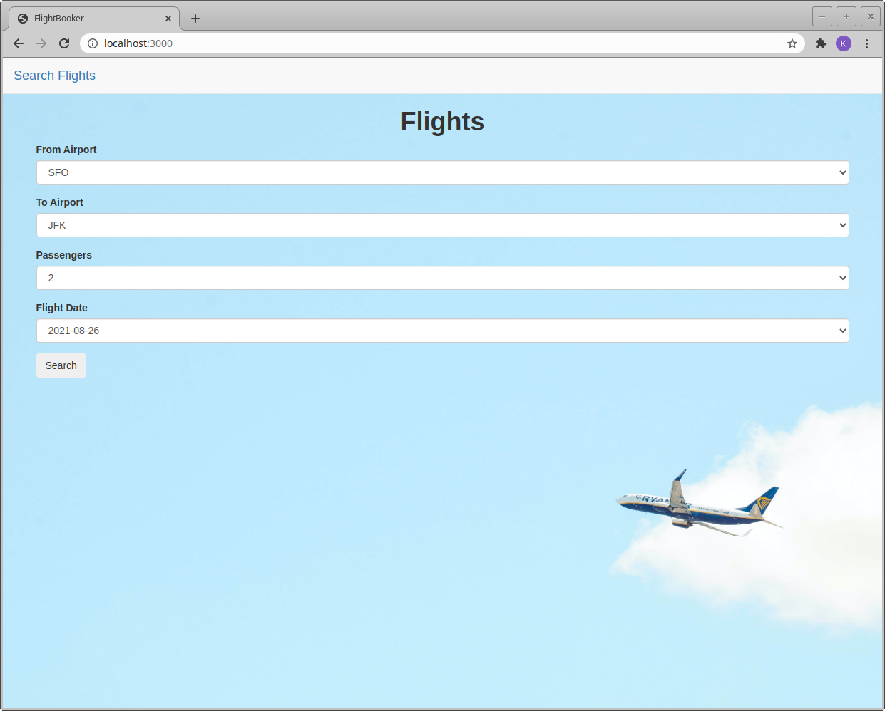
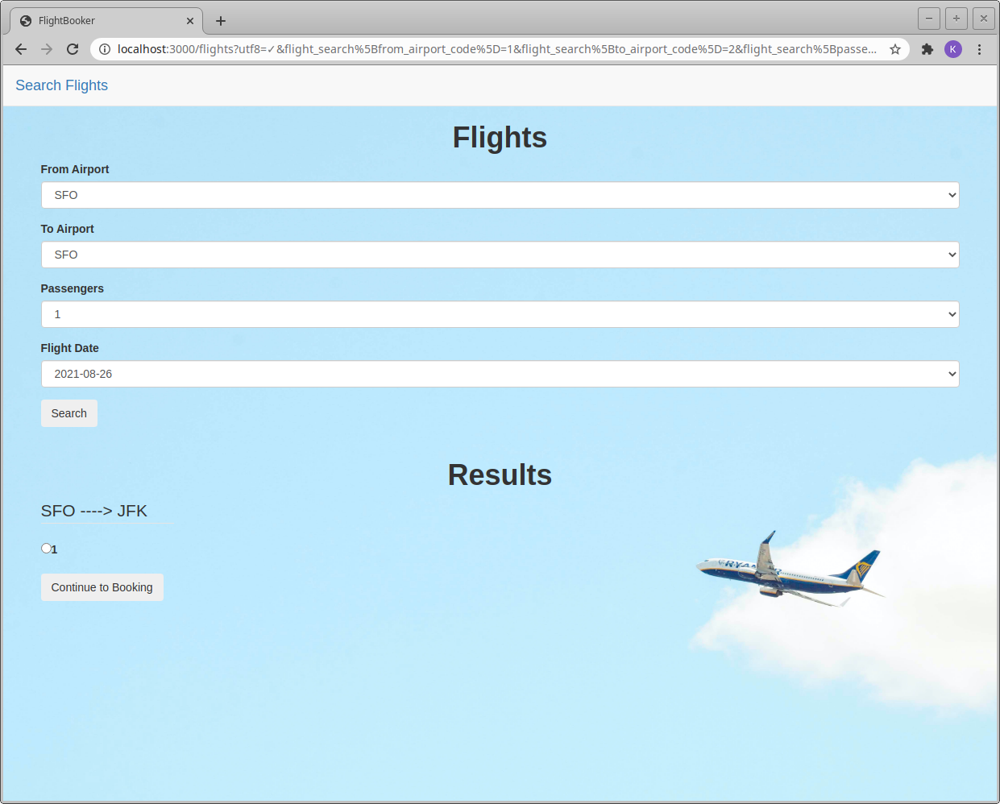

# Flight Booker

A website for searching, viewing, and booking flights.  
You can view the live server running here: https://obscure-temple-39720.herokuapp.com/.

## What I Learned

The purpose of building this website was to get exposure to working with advanced forms and using seeded data. In this project a user can search for flights, view the results, and book a flight. This required me to create a database full of data including the airport codes and combinations of different flights including the departure location, arrival location, and the date (the number of passengers were handled in a hidden field and passed into parameters). Creating the associations took a bit of time and thought as I needed to make the connections for a flight from an airport, to an airport, and then eventually connect it all with the final booking page with the passenger information; for this to work properly I had to use ``#accepts_nested_attributes_for`` on the booking model. 

I then briefly styled the application for presentation purposes, and deployed to Heroku. The biggest learning part of this project for me was reinforcing my understanding of associations which can be tricky, working with seeded data, and getting my forms to submit properly and paying a lot of attention to what is going on in the parameters within the server log.

### Update
I tested adding some mailers to this application. I was surprised by overall how easy it was to do, it was very similar to building a new controller and views. An email is sent to each passenger upon completing a booking, but in development mode only. I tried getting this set up in production mode on Heroku, but I ran into an odd error while using SendGrid, which resulted in my account being automatically "banned" upon creating it and trying to add it as a Heroku Addon. I searched the web for a bit and found this to actually be a common issue/bug with SendGrid and Heroku. For now, I've decided to move on, but I feel confident in knowing how to add email distributions if needed.

### Gem List

- <a href="https://rubygems.org/gems/bootstrap-sass">bootstrap-sass</a>
- <a href="https://rubygems.org/gems/simple_form">simple_form</a>
- <a href="https://rubygems.org/gems/sassc-rails">sassc-rails</a>
- <a href="https://rubygems.org/gems/jquery-rails">jquery-rails</a>

### Homepage
  
  
  

